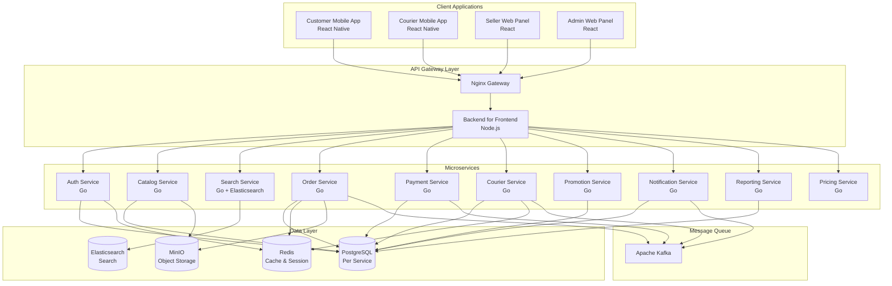
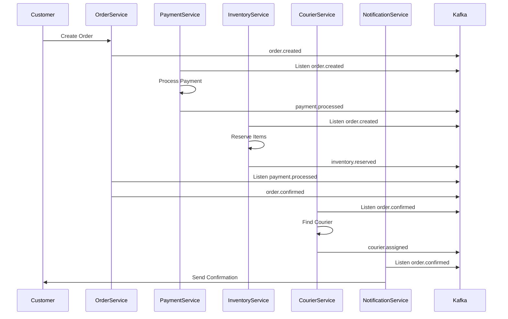

# Cebeuygun Platform Architecture

## Overview

The Cebeuygun platform is a multi-vendor e-commerce system designed for express delivery (10-30 minutes) built with a microservices architecture. The system supports multiple user types: customers, sellers, couriers, and administrators.

## System Architecture

## Service Responsibilities

### 1. Authentication Service (Go)
- User registration and login
- JWT token management
- Password reset functionality
- Role-based access control
- Session management

**Database**: PostgreSQL (auth_db)
**Cache**: Redis for sessions and tokens

### 2. Catalog Service (Go)
- Product management (CRUD)
- Category management
- Inventory tracking
- Product variants and attributes
- Seller product management

**Database**: PostgreSQL (catalog_db)
**Storage**: MinIO for product images

### 3. Search Service (Go + Elasticsearch)
- Product search with full-text search
- Filtering and faceted search
- Search suggestions and autocomplete
- Geolocation-based search
- Search analytics

**Search Engine**: Elasticsearch
**Cache**: Redis for popular searches

### 4. Order Service (Go)
- Order creation and management
- Order status tracking
- Order history
- Cart management
- Express delivery scheduling

**Database**: PostgreSQL (order_db)
**Cache**: Redis for active orders
**Events**: Kafka for order events

### 5. Payment Service (Go)
- Payment processing
- Multiple payment methods
- Transaction management
- Refund handling
- Payment status tracking

**Database**: PostgreSQL (payment_db)
**Events**: Kafka for payment events

### 6. Courier Service (Go)
- Courier management
- Delivery assignment
- Route optimization
- Real-time tracking
- Delivery status updates

**Database**: PostgreSQL (courier_db)
**Cache**: Redis for real-time location
**Events**: Kafka for delivery events

### 7. Promotion Service (Go)
- Discount and coupon management
- Promotional campaigns
- Loyalty programs
- Price calculation with discounts

**Database**: PostgreSQL (promotion_db)

### 8. Notification Service (Go)
- Push notifications
- SMS notifications
- Email notifications
- In-app notifications
- Notification templates

**Database**: PostgreSQL (notification_db)
**Events**: Kafka consumer for all events

### 9. Reporting Service (Go)
- Business analytics
- Sales reports
- Performance metrics
- Custom dashboards
- Data aggregation

**Database**: PostgreSQL (reporting_db)
**Analytics**: Data pipeline from all services

### 10. Pricing Service (Go)
- Dynamic pricing
- Express delivery pricing
- Distance-based pricing
- Peak hour pricing
- Seller commission calculation

**Database**: PostgreSQL (pricing_db)

## Event-Driven Architecture

The platform uses Apache Kafka for asynchronous communication between services:

### Event Topics

- `user.registered` - New user registration
- `order.created` - New order placed
- `order.confirmed` - Order confirmed by seller
- `order.dispatched` - Order assigned to courier
- `order.delivered` - Order delivered to customer
- `payment.processed` - Payment completed
- `payment.failed` - Payment failed
- `courier.assigned` - Courier assigned to delivery
- `courier.location.updated` - Real-time location update
- `inventory.updated` - Product inventory changes
- `promotion.applied` - Discount applied to order

### Event Flow Example: Order Processing

## Data Architecture

### Database Strategy
- **Database per Service**: Each microservice has its own PostgreSQL database
- **Data Consistency**: Eventually consistent through events
- **ACID Transactions**: Within service boundaries only
- **Read Replicas**: For reporting and analytics

### Caching Strategy
- **Redis Centralized**: Shared cache for session data, hot data
- **Application Level**: In-memory caching for static data
- **CDN**: For static assets and images

### Storage Strategy
- **MinIO**: Object storage for files, images, documents
- **PostgreSQL**: Transactional data
- **Elasticsearch**: Search indexes and full-text search
- **Redis**: Session data, real-time data, cache

## Security Architecture

### Authentication & Authorization
- **JWT Tokens**: Stateless authentication
- **Role-Based Access Control (RBAC)**: Customer, Seller, Courier, Admin roles
- **API Gateway Security**: Rate limiting, DDoS protection
- **Service-to-Service**: mTLS for internal communication

### Data Security
- **Encryption at Rest**: Database encryption
- **Encryption in Transit**: TLS/SSL for all communications
- **PII Protection**: Personal data encryption
- **Audit Logging**: All sensitive operations logged

## Scalability & Performance

### Horizontal Scaling
- **Stateless Services**: All services are stateless
- **Load Balancing**: Nginx for HTTP, gRPC load balancing
- **Database Sharding**: Horizontal partitioning for large datasets
- **Caching**: Multi-level caching strategy

### Performance Targets
- **API Response Time**: < 200ms (95th percentile)
- **Search Response Time**: < 100ms
- **Order Processing**: < 5 seconds end-to-end
- **Real-time Updates**: < 1 second delivery
- **Throughput**: 10,000 orders/minute capacity

## Monitoring & Observability

### Logging
- **Structured Logging**: JSON format with correlation IDs
- **Centralized Logging**: ELK/EFK stack
- **Log Levels**: Debug, Info, Warn, Error, Fatal

### Metrics
- **Application Metrics**: Custom business metrics
- **Infrastructure Metrics**: CPU, memory, disk, network
- **Database Metrics**: Query performance, connection pools

### Tracing
- **Distributed Tracing**: Request tracing across services
- **Performance Monitoring**: APM tools integration

### Health Checks
- **Service Health**: HTTP health endpoints
- **Dependency Health**: Database, cache, external services
- **Deep Health Checks**: Business logic validation

## Deployment Architecture

### Containerization
- **Docker**: All services containerized
- **Multi-stage Builds**: Optimized container images
- **Security Scanning**: Container vulnerability scanning

### Orchestration
- **Kubernetes Ready**: Deployment manifests provided
- **Helm Charts**: Parametrized deployments
- **Rolling Updates**: Zero-downtime deployments

### CI/CD Pipeline
- **Source Control**: Git-based workflow
- **Automated Testing**: Unit, integration, e2e tests
- **Quality Gates**: Code coverage, security scanning
- **Automated Deployment**: GitOps approach

## Development Workflow

### Local Development
- **Docker Compose**: Complete local environment
- **Hot Reloading**: Fast development iteration
- **Service Mocking**: Independent service development

### Testing Strategy
- **Unit Tests**: 80%+ code coverage target
- **Integration Tests**: API contract testing
- **End-to-End Tests**: Critical user journeys
- **Load Testing**: Performance validation

### Code Quality
- **Linting**: ESLint for TypeScript, golangci-lint for Go
- **Code Formatting**: Prettier, gofmt
- **Pre-commit Hooks**: Automated quality checks
- **Code Reviews**: Pull request based workflow

This architecture provides a solid foundation for a scalable, maintainable, and high-performance e-commerce platform capable of handling express delivery requirements.